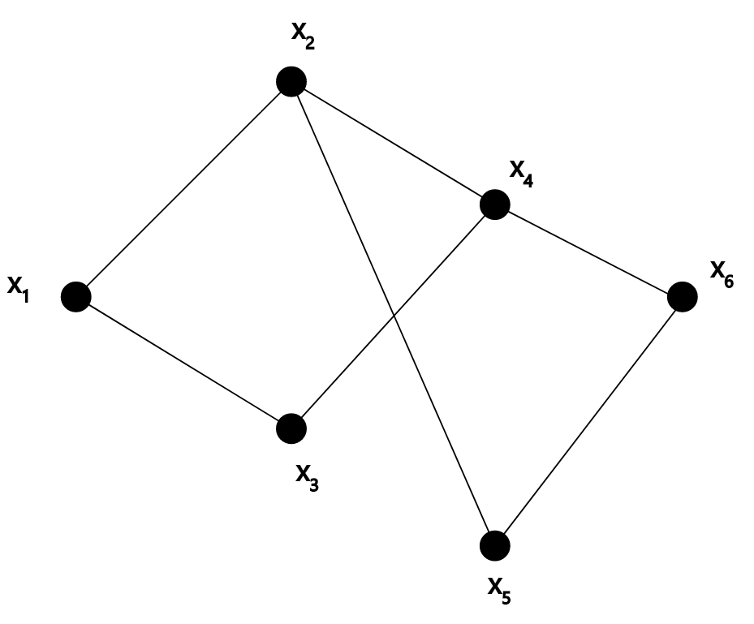

name: inverse
layout: true
class: center, middle, inverse
---
# ENSE 350: Math for Software Eng.

### Lecture 8: Introduction to Graph Theory

Adam Tilson, M.A.Sc., Engineer-in-Training

---
layout: false
.left-column[
  ## Agenda
]
.right-column[

]

---
## Graph

---
## Graph
- A graph, $G$, is a pair of sets, $(V,E)$.
  - $V$ is a non-empty set of vertices (nodes)
  - $E$ is a set of two item subsets of $V$ called edges
- e.g. $V = ${$x_1, x_2, x_3, x_4, x_5, x_6$}$

---
## Graph Definitions
Adjacent: Two notes $x_i$ and $x_j$ are adjacent if {$x_i, x_j$}$ \in E$
Incident: An edge $e=${$x_i, x_j$}$ is incident to $x_i, x_j$
Degree: The degree of a vertex is the number of edges adjacent to it
Simple: A graph is simple if it has no loops or multiple edges
  - Loops are created when nodes connect to themselves
  - Multi-edges are created when a pair of nodes share more than one edge
---
### References

- Dr. Abdul Bais's ENSE 350 Slides
- Tom Leighton, and Marten Dijk. 6.042J Mathematics for Computer Science. Fall 2010, Lecture 4. Massachusetts Institute of Technology: MIT OpenCourseWare, https://ocw.mit.edu. License: Creative Commons BY-NC-SA.
---

name: inverse
layout: true
class: center, middle, inverse
---
# Questions?
